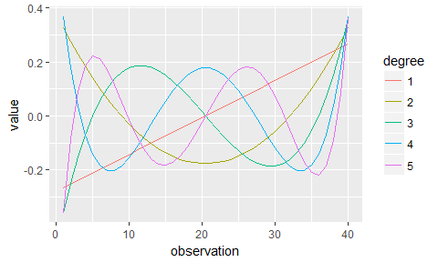
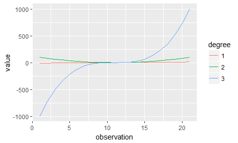
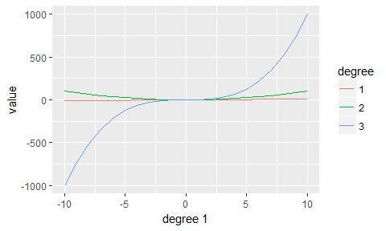
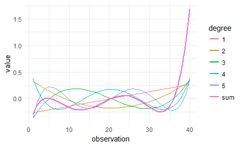
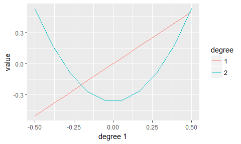
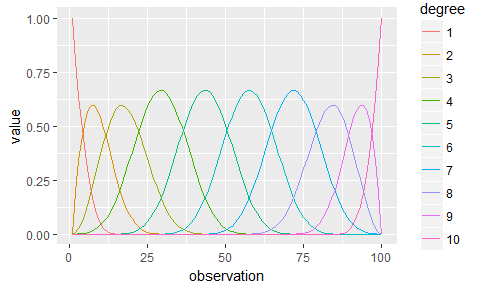
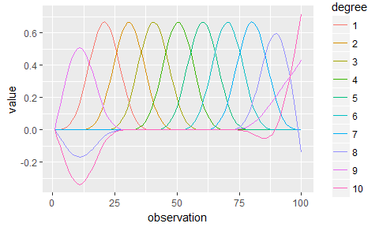
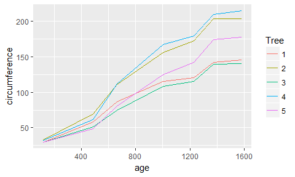
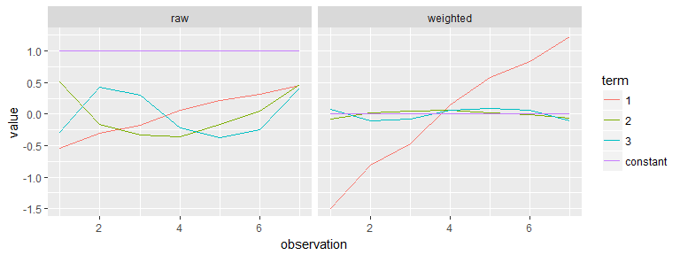

<!-- README.md is generated from README.Rmd. Please edit that file -->


polypoly
========

[](https://travis-ci.org/tjmahr/polypoly) [](https://cran.r-project.org/package=polypoly)

Helper functions for polynomials created by `poly()`.

Installation
------------

Install the latest release of polypoly from CRAN:

``` r
install.packages("polypoly")
```

Or install the developmental version from Github:

``` r
# install.packages("devtools")
devtools::install_github("tjmahr/polypoly")
```

Background
----------

The `poly()` function in the `stats` package creates a matrix of (orthogonal) polynomials over a set of values. The code below shows some examples of these matrices.

``` r
# orthogonal polynomials
m <- poly(1:6, degree = 3, simple = TRUE)
m
#>               1          2          3
#> [1,] -0.5976143  0.5455447 -0.3726780
#> [2,] -0.3585686 -0.1091089  0.5217492
#> [3,] -0.1195229 -0.4364358  0.2981424
#> [4,]  0.1195229 -0.4364358 -0.2981424
#> [5,]  0.3585686 -0.1091089 -0.5217492
#> [6,]  0.5976143  0.5455447  0.3726780

# the terms are uncorrelated. that's why they are "orthogonal".
zapsmall(cor(m))
#>   1 2 3
#> 1 1 0 0
#> 2 0 1 0
#> 3 0 0 1

# raw polynomials
m <- poly(1:6, degree = 3, simple = TRUE, raw = TRUE)
m
#>      1  2   3
#> [1,] 1  1   1
#> [2,] 2  4   8
#> [3,] 3  9  27
#> [4,] 4 16  64
#> [5,] 5 25 125
#> [6,] 6 36 216

# raw polynomials are highly correlated.
round(cor(m), 2)
#>      1    2    3
#> 1 1.00 0.98 0.94
#> 2 0.98 1.00 0.99
#> 3 0.94 0.99 1.00
```

This package provides some helpful functions for working with these matrices.

Examples
--------

### Tidying

This package provides a tidying function `poly_melt()`.

``` r
library(polypoly)
xs <- 1:40
poly_mat <- poly(xs, degree = 5)
poly_melt(poly_mat)
#> # A tibble: 200 x 3
#>    observation degree      value
#>          <int>  <chr>      <dbl>
#>  1           1      1 -0.2670982
#>  2           2      1 -0.2534009
#>  3           3      1 -0.2397035
#>  4           4      1 -0.2260062
#>  5           5      1 -0.2123088
#>  6           6      1 -0.1986115
#>  7           7      1 -0.1849142
#>  8           8      1 -0.1712168
#>  9           9      1 -0.1575195
#> 10          10      1 -0.1438221
#> # ... with 190 more rows
```

The returned dataframe has one row per cell of the original matrix. Essentialy, the columns of the matrix are stacked on top of each other to create a long dataframe. The `observation` and `degree` columns record each values' original row number and column name, respectively.

### Plotting

Plot a matrix with `poly_plot()`.

``` r
poly_plot(poly_mat)
```



We can also plot raw polynomials, but that display is less useful because the *x*-axis corresponds to the row number of polynomial matrix.

``` r
poly_raw_mat  <- poly(-10:10, degree = 3, raw = TRUE)
poly_plot(poly_raw_mat)
```



We can make the units clearer by using `by_observation = FALSE` so that the *x*-axis corresponds to the first column of the polynomial matrix.

``` r
poly_plot(poly_raw_mat, by_observation = FALSE)
```



`poly_plot()` returns a plain ggplot2 plot, so we can further customize the output. For example, we can use ggplot2 to compute the sum of the individual polynomials and re-theme the plot.

``` r
library(ggplot2)
poly_plot(poly_mat) + 
  stat_summary(aes(color = "sum"), fun.y = "sum", geom = "line", size = 1) + 
  theme_minimal()
```



For total customization, `poly_plot_data()` will return the dataframe that *would* have been plotted by `poly_plot()`.

``` r
poly_plot_data(poly_mat, by_observation = FALSE)
#> # A tibble: 200 x 4
#>    observation degree       value `degree 1`
#>          <int> <fctr>       <dbl>      <dbl>
#>  1           1      1 -0.26709823 -0.2670982
#>  2           1      2  0.32799146 -0.2670982
#>  3           1      3 -0.35999228 -0.2670982
#>  4           1      4  0.36922435 -0.2670982
#>  5           1      5 -0.35999228 -0.2670982
#>  6           2      5 -0.08307514 -0.2534009
#>  7           2      1 -0.25340088 -0.2534009
#>  8           2      2  0.27753123 -0.2534009
#>  9           2      3 -0.24922542 -0.2534009
#> 10           2      4  0.17987853 -0.2534009
#> # ... with 190 more rows
```

### Rescaling a matrix

The ranges of the terms created by `poly()` are sensitive to repeated values.

``` r
# For each column in a matrix, return difference between max and min values
col_range <- function(matrix) {
  apply(matrix, 2, function(xs) max(xs) - min(xs))  
}

p1 <- poly(0:9, degree = 2)
p2 <- poly(rep(0:9, 18), degree = 2)

col_range(p1)
#>         1         2 
#> 0.9908674 0.8703883
col_range(p2)
#>         1         2 
#> 0.2335497 0.2051525
```

Thus, two models fit with `y ~ poly(x, 3)` will not have comparable coefficients when the number of rows changes, even if the unique values of `x` did not change!

`poly_rescale()` adjusts the values in the polynomial matrix so that the linear component has a specified range. The other terms are scaled by the same factor.

``` r
col_range(poly_rescale(p1, scale_width = 1))
#>         1         2 
#> 1.0000000 0.8784105
col_range(poly_rescale(p2, scale_width = 1))
#>         1         2 
#> 1.0000000 0.8784105

poly_plot(poly_rescale(p2, scale_width = 1), by_observation = FALSE)
```



### Adding columns to a dataframe

`poly_add_columns()` adds orthogonal polynomial transformations of a predictor variable to a dataframe.

Here's how we could add polynomials to the `sleepstudy` dataset.

``` r
df <- tibble::as_tibble(lme4::sleepstudy)
print(df)
#> # A tibble: 180 x 3
#>    Reaction  Days Subject
#>       <dbl> <dbl>  <fctr>
#>  1 249.5600     0     308
#>  2 258.7047     1     308
#>  3 250.8006     2     308
#>  4 321.4398     3     308
#>  5 356.8519     4     308
#>  6 414.6901     5     308
#>  7 382.2038     6     308
#>  8 290.1486     7     308
#>  9 430.5853     8     308
#> 10 466.3535     9     308
#> # ... with 170 more rows

poly_add_columns(df, Days, degree = 3)
#> # A tibble: 180 x 6
#>    Reaction  Days Subject       Days1       Days2      Days3
#>       <dbl> <dbl>  <fctr>       <dbl>       <dbl>      <dbl>
#>  1 249.5600     0     308 -0.49543369  0.52223297 -0.4534252
#>  2 258.7047     1     308 -0.38533732  0.17407766  0.1511417
#>  3 250.8006     2     308 -0.27524094 -0.08703883  0.3778543
#>  4 321.4398     3     308 -0.16514456 -0.26111648  0.3346710
#>  5 356.8519     4     308 -0.05504819 -0.34815531  0.1295501
#>  6 414.6901     5     308  0.05504819 -0.34815531 -0.1295501
#>  7 382.2038     6     308  0.16514456 -0.26111648 -0.3346710
#>  8 290.1486     7     308  0.27524094 -0.08703883 -0.3778543
#>  9 430.5853     8     308  0.38533732  0.17407766 -0.1511417
#> 10 466.3535     9     308  0.49543369  0.52223297  0.4534252
#> # ... with 170 more rows
```

We can optionally customize the column names and rescale the polynomial terms.

``` r
poly_add_columns(df, Days, degree = 3, prefix = "poly_", scale_width = 1)
#> # A tibble: 180 x 6
#>    Reaction  Days Subject      poly_1      poly_2     poly_3
#>       <dbl> <dbl>  <fctr>       <dbl>       <dbl>      <dbl>
#>  1 249.5600     0     308 -0.50000000  0.52704628 -0.4576043
#>  2 258.7047     1     308 -0.38888889  0.17568209  0.1525348
#>  3 250.8006     2     308 -0.27777778 -0.08784105  0.3813369
#>  4 321.4398     3     308 -0.16666667 -0.26352314  0.3377556
#>  5 356.8519     4     308 -0.05555556 -0.35136418  0.1307441
#>  6 414.6901     5     308  0.05555556 -0.35136418 -0.1307441
#>  7 382.2038     6     308  0.16666667 -0.26352314 -0.3377556
#>  8 290.1486     7     308  0.27777778 -0.08784105 -0.3813369
#>  9 430.5853     8     308  0.38888889  0.17568209 -0.1525348
#> 10 466.3535     9     308  0.50000000  0.52704628  0.4576043
#> # ... with 170 more rows
```

We can confirm that the added columns are orthogonal.

``` r
df <- poly_add_columns(df, Days, degree = 3, scale_width = 1)
zapsmall(cor(df[c("Days1", "Days2", "Days3")]))
#>       Days1 Days2 Days3
#> Days1     1     0     0
#> Days2     0     1     0
#> Days3     0     0     1
```

### Experimental

#### Splines

This package also (accidentally) works on splines. Splines are not officially supported, but they could be an avenue for future development.

``` r
poly_plot(splines::bs(1:100, 10, intercept = TRUE))
```



``` r
poly_plot(splines::ns(1:100, 10, intercept = FALSE))
```



Longer example: Visualizing growth curve contributions
------------------------------------------------------

This section illustrates a use case that may or may not be included in the package someday: Visualizing the weighting of polynomial terms from a linear model. For now, here's how to do that task with this package.

Suppose we want to model some change over time using a cubic polynomial. For example, the growth of trees.

``` r
library(lme4)
#> Loading required package: Matrix
df <- tibble::as_tibble(Orange)
df$Tree <- as.character(df$Tree)
df
#> # A tibble: 35 x 3
#>     Tree   age circumference
#>  * <chr> <dbl>         <dbl>
#>  1     1   118            30
#>  2     1   484            58
#>  3     1   664            87
#>  4     1  1004           115
#>  5     1  1231           120
#>  6     1  1372           142
#>  7     1  1582           145
#>  8     2   118            33
#>  9     2   484            69
#> 10     2   664           111
#> # ... with 25 more rows

ggplot(df) + 
  aes(x = age, y = circumference, color = Tree) + 
  geom_line()
```



We can bind the polynomial terms onto the data and fit a model.

``` r
df <- poly_add_columns(Orange, age, 3, scale_width = 1)

model <- lmer(
  scale(circumference) ~ age1 + age2 + age3 + (age1 + age2 + age3 | Tree), 
  data = df)
summary(model)
#> Linear mixed model fit by REML ['lmerMod']
#> Formula: 
#> scale(circumference) ~ age1 + age2 + age3 + (age1 + age2 + age3 |  
#>     Tree)
#>    Data: df
#> 
#> REML criterion at convergence: -11.7
#> 
#> Scaled residuals: 
#>      Min       1Q   Median       3Q      Max 
#> -1.54080 -0.42555  0.08564  0.49192  1.37387 
#> 
#> Random effects:
#>  Groups   Name        Variance Std.Dev. Corr             
#>  Tree     (Intercept) 0.125868 0.35478                   
#>           age1        0.384777 0.62030   0.99            
#>           age2        0.009972 0.09986  -0.63 -0.49      
#>           age3        0.010702 0.10345  -0.89 -0.95  0.19
#>  Residual             0.016876 0.12991                   
#> Number of obs: 35, groups:  Tree, 5
#> 
#> Fixed effects:
#>               Estimate Std. Error t value
#> (Intercept)  8.118e-16  1.602e-01   0.000
#> age1         2.719e+00  2.852e-01   9.533
#> age2        -1.520e-01  7.995e-02  -1.901
#> age3        -2.529e-01  8.086e-02  -3.128
#> 
#> Correlation of Fixed Effects:
#>      (Intr) age1   age2  
#> age1  0.950              
#> age2 -0.348 -0.266       
#> age3 -0.502 -0.529  0.062
```

How do we understand the contribution of each of these terms? We can recreate the model matrix by attaching the intercept term to a polynomial matrix.

``` r
poly_mat <- poly_rescale(poly(df$age, degree = 3), 1)

# Keep only seven rows because there are 7 observations per tree
poly_mat <- poly_mat[1:7, ]

pred_mat <- cbind(constant = 1, poly_mat)
pred_mat
#>      constant           1          2          3
#> [1,]        1 -0.54927791  0.5047675 -0.2964647
#> [2,]        1 -0.29927791 -0.1637435  0.4264971
#> [3,]        1 -0.17632709 -0.3312105  0.2957730
#> [4,]        1  0.05591335 -0.3573516 -0.2139411
#> [5,]        1  0.21096799 -0.1635520 -0.3699278
#> [6,]        1  0.30727947  0.0419906 -0.2489830
#> [7,]        1  0.45072209  0.4690995  0.4070466
```

Weight the predictors using the model fixed effects.

``` r
weighted <- pred_mat %*% diag(fixef(model))
colnames(weighted) <- colnames(pred_mat)
```

And do some tidying to plot the two sets of predictors.

``` r
df_raw <- poly_melt(pred_mat)
df_raw$predictors <- "raw"

df_weighted <- poly_melt(weighted)
df_weighted$predictors <- "weighted"

df_both <- rbind(df_raw, df_weighted)

# Only need the first 7 observations because that is one tree
ggplot(df_both[df_both$observation <= 7, ]) + 
  aes(x = observation, y = value, color = degree) + 
  geom_line() + 
  facet_grid(. ~ predictors) + 
  labs(color = "term")
```



The linear trend drives the growth curve. The quadratic and cubic terms make tiny contributions. We can see that the intercept term does nothing (because we used `scale()` in the model).

Hmmm... perhaps we need to find a better example dataset for this example.

Resources
---------

If you searched for help on `poly()`, see also:

-   [What does the R function `poly()` really do?](https://stackoverflow.com/questions/19484053/what-does-the-r-function-poly-really-do)
-   [Source code for the poly function](https://github.com/wch/r-source/blob/af7f52f70101960861e5d995d3a4bec010bc89e6/src/library/stats/R/contr.poly.R#L85)
